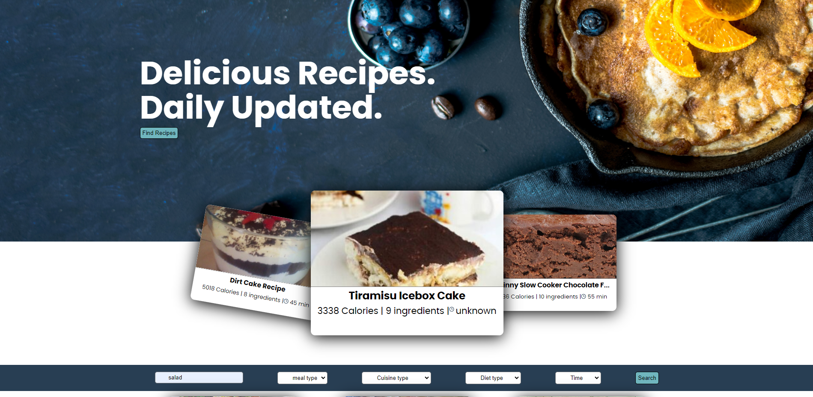

# The Clueless Cook

**Table of contents**

1. [Introduction](#Introducion)
2. [Requirements](#Requirements)
3. [Installation instructions](#Installation instructions)

## Introduction

The clueless Cook is the End assignment we were given at NOVI for our Bootcamp Web Development.\
This application is made using the EdemanAPI and its goal is to create a application were you can look up recepis based on ingredients or name.\
next to that there is a page ware you can input a product to look up the nutrients from that.

## Requirements

To use this application you will need to have to following.\
1 set of API Key and ID for the Food Database API.\
1 set of API Key and ID for the Recipe Search API.\
A internet connection

## Installation instructions

In order to Use the application follow the following steps.\
Run the following command in the terminal 'npm init'.\
After the npm Installation is complete you will need to place the API keys on the correct places.\
The API keys are provided withing the given zip file. and are located in the text file called API_Keys.\
place the Food Database API [here](src/functions/fetchProducts.js) where you can replace the placeholders on line 9 and 10 with the Key and ID.\
Do the same [here](src/functions/fetchRecipe.js)  and [here](src/functions/fetchRecipeData.js) for the Recipe Search API.\

When this is done you can run the following command 'npm run start' in the terminal and click on the provided link called Localhost.\
Not the application will start up in the webbrowser for you to look around in and enjoy.

